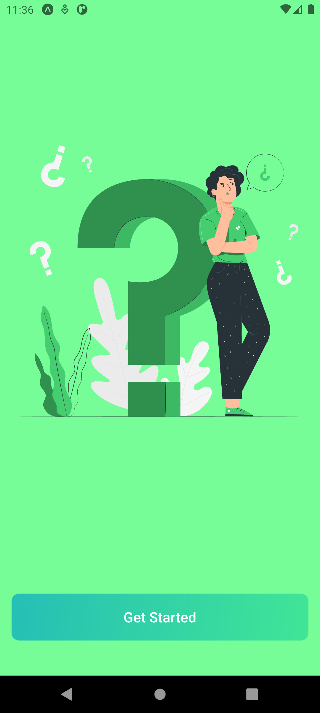
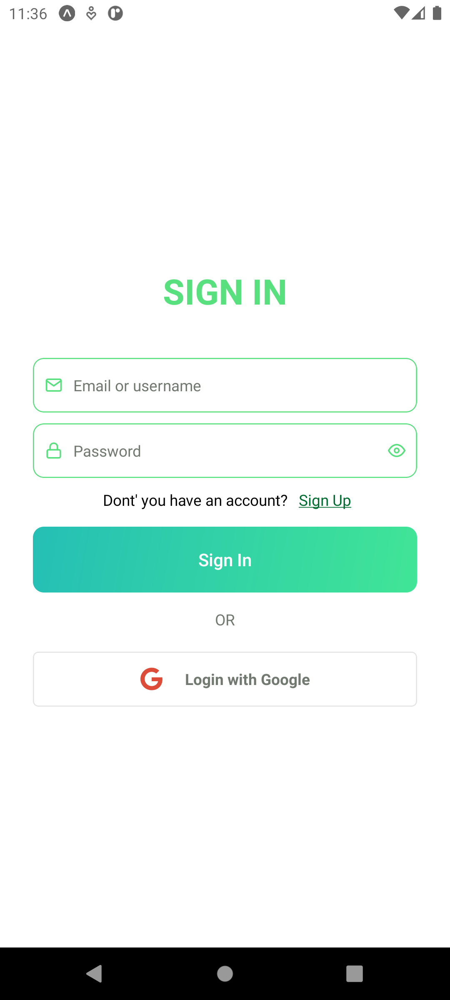
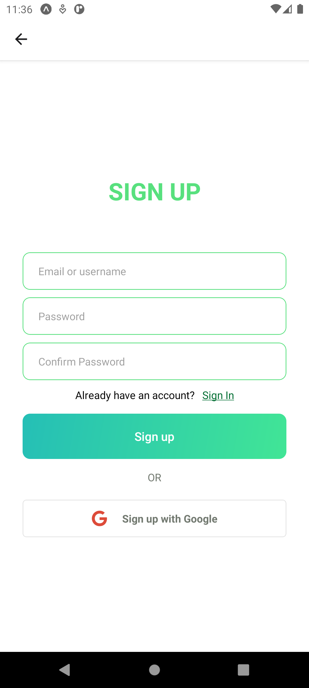
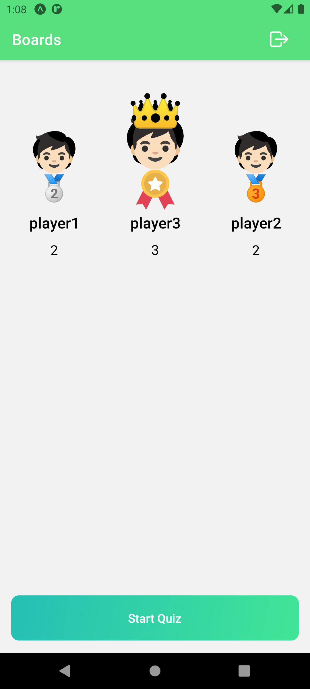
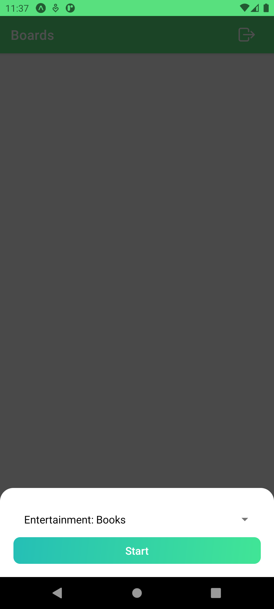
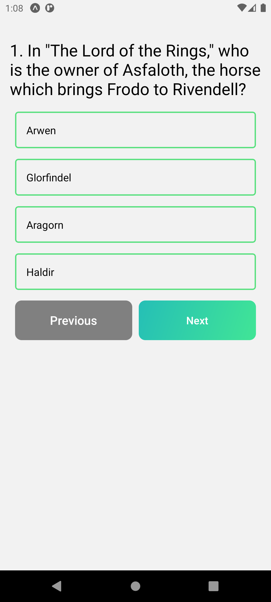

## 📝 QuizApp

A simple trivia game where players answer multiple-choice questions and keep track of their scores on the scoreboard.

## 🚀 Features
- 🔒 **Authentication**: User authentication with `Firebase/Auth`.
- 🔥 **Firebase Integration**: Utilizing `Firebase/Firestore` for data storage and `Firebase/Auth` for authentication.
- ❓ **Multiple Choice Questions**: Players answer questions with 4 choices.
- 🏆 **Scoreboard**: Displays the scores of each player during the game.
- 👤 **Player Name**: Players enter their name before starting the game to personalize the experience.


### 📸 Preview

<div style='display:"flex";flex-direction:"row";flex-wrap:"wrap" gap:"2rem"'>
   
   
   
   
   
   
   
</div>

### 🛠️ Technologies Used

- **Frontend:** 📱 React Native
- **Database:** 🔥 Firebase Firestore Firease/Auth

### 🔧 Installation

1. Clone the repository:
   ```sh
   git clone https://github.com/boypirunporn/ReactNativeQuizApp.git  
   ```
2. Navigate to the project folder:
   ```sh
   cd ReactNativeQuizApp  
   ```
3. Install dependencies:
   ```sh
   npm install  
   ```
4. Start the development server:
   ```sh
   npx expo run:android
   or
   npx expo run:ios  
   ```


<!-- ### 📄 License

This project is licensed under the MIT License. -->

<!-- 

# เกมตอบคำถาม

## คุณสมบัติ

- คำถามแบบเลือกตอบ
- Scoreboard แสดงคะแนนของแต่ละผู้เล่น
- กรอกชื่อผู้เล่นก่อนเริ่มเกม

## เทคโนโลยีที่ใช้

- React Native
- Zustand
- JavaScript/JSX
- CSS

## เริ่มต้นใช้งาน

1. Clone repository
2. Install dependencies
3. Start application

## การใช้งาน

1. เปิดแอปพลิเคชัน
2. กรอกชื่อผู้เล่น
3. เริ่มต้นตอบคำถาม

## การสนับสนุนและการพัฒนาต่อ

สามารถ fork repository และสร้าง pull request เพื่อเพิ่มฟีเจอร์หรือแก้ไขข้อผิดพลาดได้ -->
